# NFL Players API

API REST desarrollada en Go. Permite consultar, crear, actualizar y eliminar jugadores de la NFL.

## Requisitos

- Go 1.22+
- Docker y Docker Compose (opcional)

## Ejecutar el servidor

### Con Go
```bash
go run main.go
```

### Con Docker Compose
```bash
docker-compose up
```

El servidor corre en el puerto **24092**.

---

## Estructura del proyecto
```
go-http/
├── data/
│   └── players.json
├── /screenshots
├── main.go
├── Dockerfile
├── docker-compose.yml
└── README.md
```

---

## Modelo de datos

| Campo | Tipo | Descripción |
|---|---|---|
| id | int | Identificador único (auto-generado) |
| name | string | Nombre del jugador |
| team | string | Equipo NFL |
| position | string | Posición (QB, WR, etc.) |
| jersey_number | int | Número de camiseta |
| birth_year | int | Año de nacimiento |
| touchdowns | int | Total de touchdowns en carrera |

---

## Endpoints

### GET /api/players
Retorna todos los jugadores.

**Request:**
```
GET http://localhost:24092/api/players
```

**Response 200:**
```json
[
  {
    "id": 1,
    "name": "Patrick Mahomes",
    "team": "Kansas City Chiefs",
    "position": "QB",
    "jersey_number": 15,
    "birth_year": 1995,
    "touchdowns": 426
  }
]
```

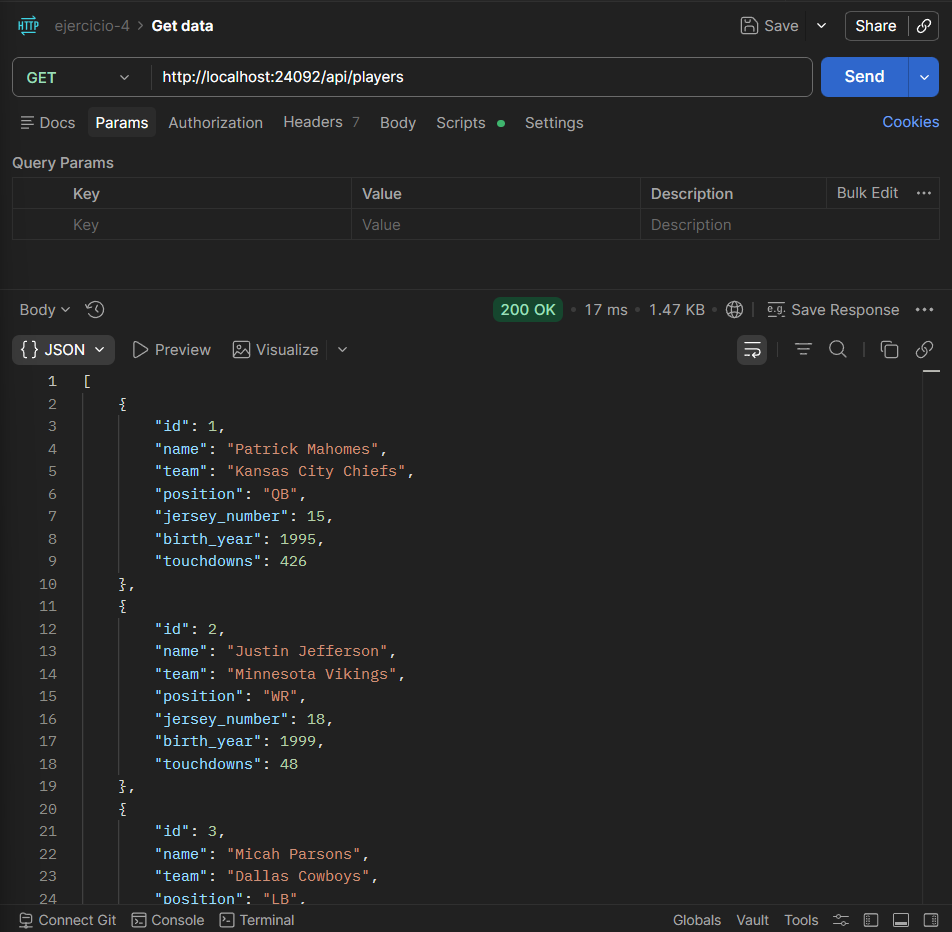

---

### GET /api/players?id=1
Retorna un jugador por query parameter.

**Request:**
```
GET http://localhost:24092/api/players?id=1
```

**Response 200:**
```json
{
  "id": 1,
  "name": "Patrick Mahomes",
  "team": "Kansas City Chiefs",
  "position": "QB",
  "jersey_number": 15,
  "birth_year": 1995,
  "touchdowns": 426
}
```

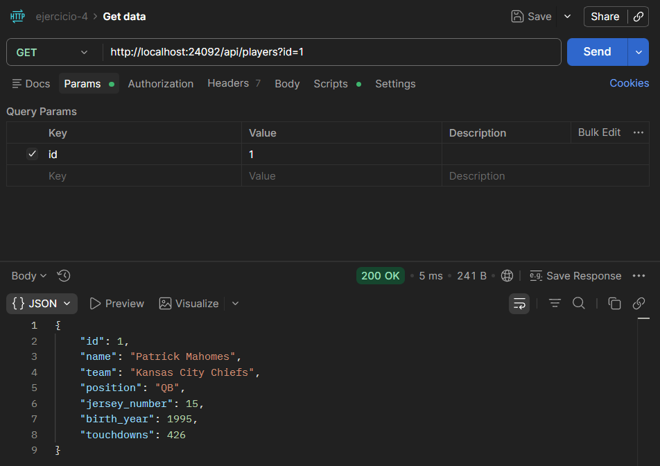

---

### GET /api/players?team=Baltimore Ravens&position=QB
Filtra jugadores por `team` y/o `position`. Se pueden combinar ambos filtros.

**Request:**
```
GET http://localhost:24092/api/players?team=Baltimore Ravens&position=QB
```

**Response 200:**
```json
[
  {
    "id": 5,
    "name": "Lamar Jackson",
    ...
  }
]
```

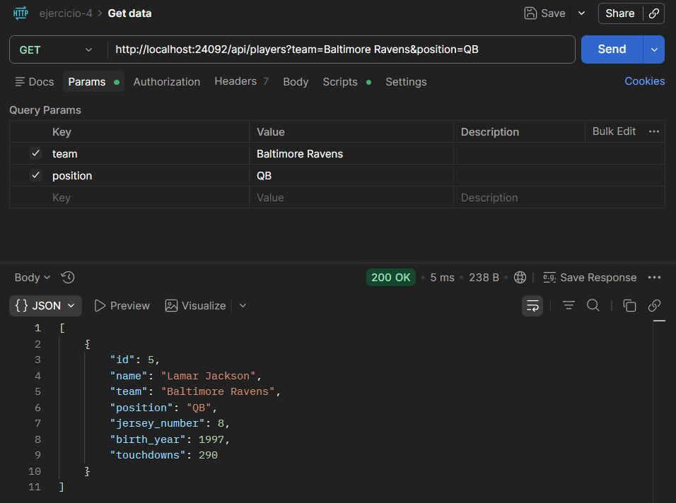

---

### GET /api/players/{id}
Retorna un jugador por path parameter.

**Request:**
```
GET http://localhost:24092/api/players/1
```

**Response 200:**
```json
{
  "id": 1,
  "name": "Patrick Mahomes",
  "team": "Kansas City Chiefs",
  "position": "QB",
  "jersey_number": 15,
  "birth_year": 1995,
  "touchdowns": 426
}
```

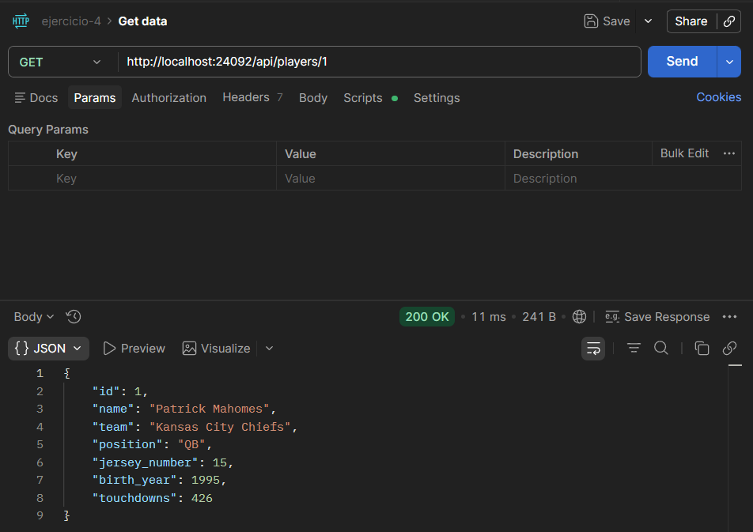

---

### POST /api/players
Crea un nuevo jugador. El `id` se genera automáticamente.

**Request:**
```
POST http://localhost:24092/api/players
Content-Type: application/json
```

**Body:**
```json
{
  "name": "Joe Burrow",
  "team": "Cincinnati Bengals",
  "position": "QB",
  "jersey_number": 9,
  "birth_year": 1996,
  "touchdowns": 130
}
```

**Response 201:**
```json
{
  "id": 11,
  "name": "Joe Burrow",
  "team": "Cincinnati Bengals",
  "position": "QB",
  "jersey_number": 9,
  "birth_year": 1996,
  "touchdowns": 130
}
```

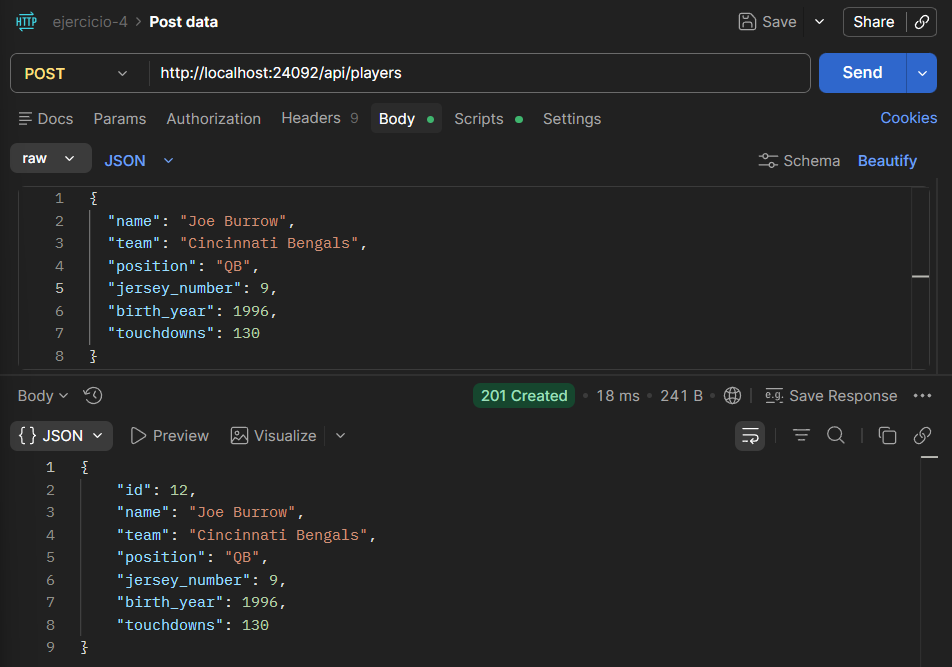

---

### PUT /api/players/{id}
Actualiza todos los campos de un jugador existente.

**Request:**
```
PUT http://localhost:24092/api/players/9
Content-Type: application/json
```

**Body:**
```json
{
    "name": "Matthew Stafford",
    "team": "Los Angeles Rams",
    "position": "QB",
    "jersey_number": 30,
    "birth_year": 1989,
    "touchdowns": 543
}
```

**Response 200:**
```json
{
    "id": 9,
    "name": "Matthew Stafford",
    "team": "Los Angeles Rams",
    "position": "QB",
    "jersey_number": 30,
    "birth_year": 1989,
    "touchdowns": 543
}
```

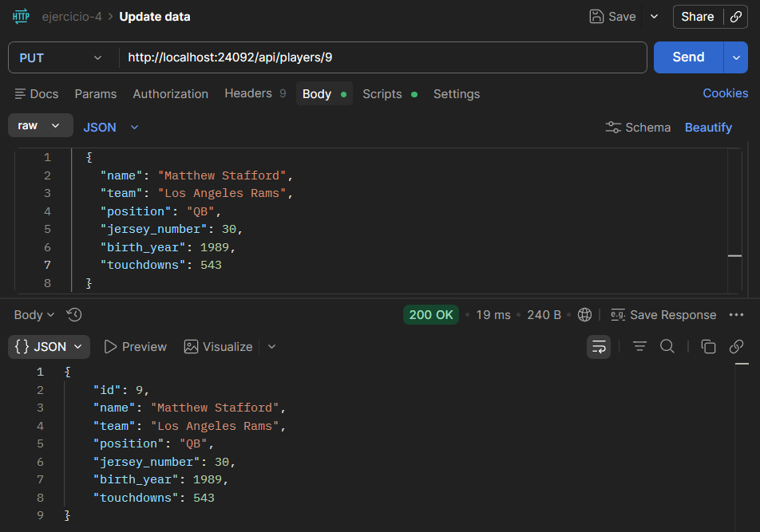

---

### PATCH /api/players/{id}
Actualiza parcialmente un jugador. Solo se modifican los campos enviados.

**Request:**
```
PATCH http://localhost:24092/api/players/1
Content-Type: application/json
```

**Body:**
```json
{
  "touchdowns": 500
}
```

**Response 200:**
```json
{
  "id": 1,
  "name": "Patrick Mahomes",
  "team": "Kansas City Chiefs",
  "position": "QB",
  "jersey_number": 15,
  "birth_year": 1995,
  "touchdowns": 500
}
```

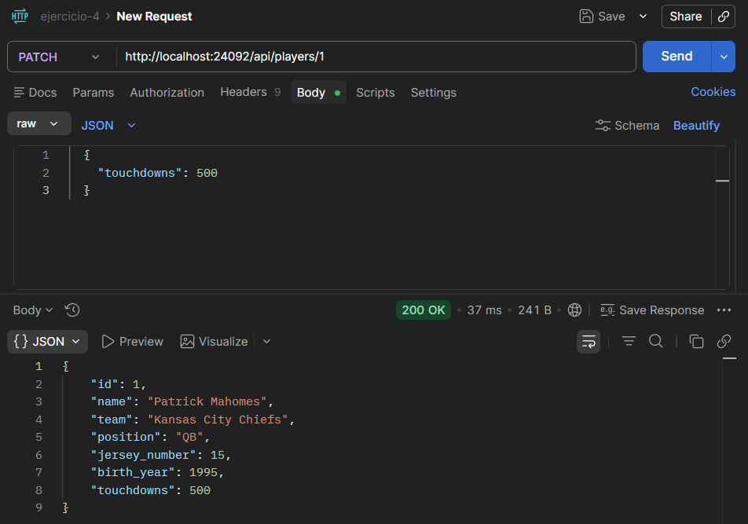

---

### DELETE /api/players/{id}
Elimina un jugador por ID.

**Request:**
```
DELETE http://localhost:24092/api/players/1
```

**Response 200:**
```json
{
  "message": "Player deleted successfully"
}
```

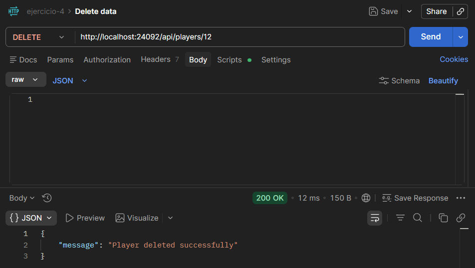

**Response 404:**
```json
{
  "error": "Player not found"
}
```

Ya no se encuentra el jugador porque fue eliminado

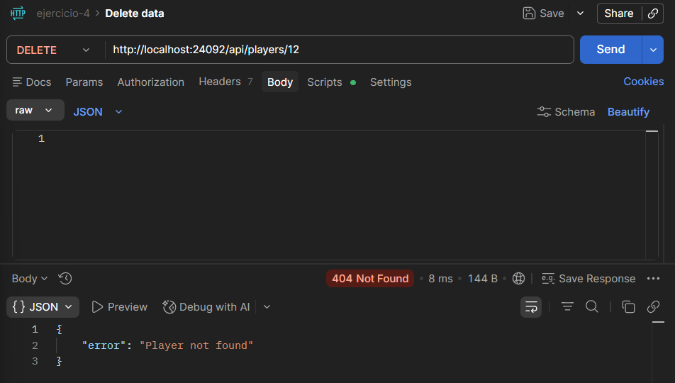

---

## Casos de error

| Código | Descripción |
|---|---|
| 400 | JSON inválido o campos faltantes/incorrectos |
| 404 | Jugador no encontrado |
| 405 | Método HTTP no permitido |

### Error 400
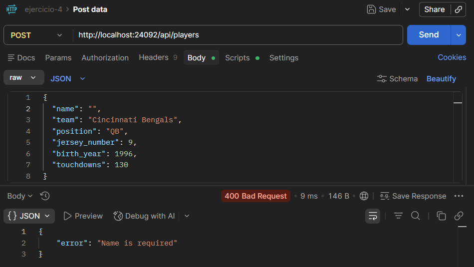

### Error 404
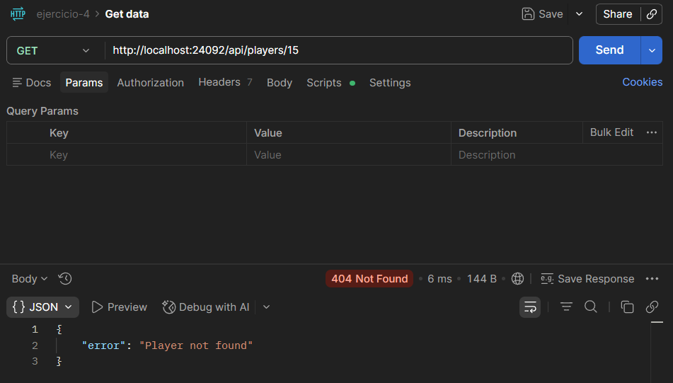